# Computer Networks

## Glossary

- LAN local-area nextwork
- MAC media access control
- ARQ automatic repeat request
- CSMA/CD/CA carrier sense multiple access with collision avoidance/detection
- CRC cyclic redundancy check
- VCI virtual circuit idetifier
- ARP address resolution protocol
- UDP user datagram protocol
- ICMP internet control message protocol
- FTP file transfer protocol
- TCP transmission control protocol
- HTTP hypertext transfer protocol
- RIP routing information protocol
- SMTP simple mail transfer protocol
- POP post office protocol
- IMAP inter message access protocol
- FDDI fiber distributed data interface
- OSPF open shortest path first
- CIDR classless inter-domain routing
- DNS domain name service

## Homework Solutions

### 1-3

#### Question

Calculate the total time required to transfer a 1000-KB file in the following cases, assuming an RTT of 50 ms, a packet size of 1 KB data, and an initial 2×RTT of “handshaking” before data is sent:

(a) The bandwidth is 1.5 Mbps, and data packets can be sent continuously.  
(b) The bandwidth is 1.5 Mbps, but after we finish sending each data packet we must wait one RTT before sending the next.  
(c) The bandwidth is “infinite,” meaning that we take transmit time to be zero, and up to 20 packets can be sent per RTT.  
(d) The bandwidth is infinite, and during the first RTT we can send one packet , during the second RTT we can send two packets, during the third we can send four, and so on.   

#### Solution

Latency = Propagation + Transmit + Queue  
Propagation = Distance / c  
Transmit = Size / Bandwidth  

(a) 50ms/2 + 1000KB/1.5Mbps + 50ms × 2 = 5.333 s  
(b) 5.333 s + 50ms × 999 = 55.283 s  
(c) 50ms/2 + 50ms × 2 + 50ms × 49 = 2.575 s  
(d) 1 + 2 + 2^2 + 2^n-1 = 2^n-1 ≧ 1000 ,  n = 10   
50ms/2 + 50ms × 2 + 50ms × 9 = 0.575 s

### 1-5

#### Question

Consider a point-to-point link 4 km in length. At what bandwidth would propagation delay (at a speed of 2× 10^8m/s) equal transmit delay for 100-byte packets? What about 512-byte packets?

#### Solution

B = 100 × 8 b/ (4 km / (2× 10^8m/s) )  =  4 × 107bps = 40 Mbps  
For 512 byte, B = 512 × 8 b/ (4 km / (2× 10^8m/s) ) = 204.8 Mbps

### 1-11

#### Question

How “wide” is a bit on a 10-Gbps link? How long is a bit in copper wire, where the speed of propagation is 2.3× 108m/s?

#### Solution

1 bit / 10 Gbps = 10^-10s   
10^-10s x 2.3 × 10^8m/s = 0.023 m

### 1-13

#### Question

Suppose a 1-Gbps point-to-point link is being set up between the Earth and a new lunar colony. The distance from the moon to the Earth is approximately 385,000 km, and data travels over the link at the speed of light 3×10^8m/s.  
(a) Calculate the minimum RTT for the link.  
(b) Using the RTT as the delay, calculate the delay × bandwidth product for the link.  
(c) What is the significance of the delay × bandwidth product computed in (b)?  
(d) A camera on the lunar base takes pictures of the Earth and saves them in digital format to disk. Suppose Mission Control on Earth wishes to download the most current image, which is 25 MB. What is the minimum amount of time that will elapse between when the request for the data goes out and the transfer is finished?  

#### Solution

(a) 385,000 km ×2 / 3×10^8m/s = 2.567 s  
(b) 2.567 s × 1 Gbps  =  2.567 Gb  = 328MB  
(c) If the receiver tells the sender to stop transmitting it might receive up to one RTT×bandwidth’s worth of data before the sender manages to respond.  
(d) 2.567s + 25MB / 1 Gbps = 2.767 s

### 1-16

#### Question

Calculate the latency (from first bit sent to last bit received) for the following:  
(a) 100-Mbps Ethernet with a single store-and-forward switch in the path and a packet size of 12,000 bits. Assume that each link introduces a propagation delay of 10 μs and that the switch begins retransmitting immediately after it has finished receiving the packet.  
(b) Same as (a) but with three switches.  
(c) Same as (a), but assume the switch implements “cutthrough” switching; it is able to begin retransmitting the packet after the first 200 bits have been received.  

#### Solution

(a)  (12000 b/ 100 Mbps + 10 μs )× 2 = 260  μs   
(b)  (12000 b/ 100 Mbps + 10 μs )× 4 = 520  μs   
(c)  12000 b/ 100 Mbps + 10 μs  + 200 b/ 100 Mbps + 10 μs = 142 μs 

### 2-1

#### Question

Show the NRZ,Manchester, and NRZI encodings for the bit pattern shown in Figure 2.36. Assume that the NRZI signal starts out low.

#### Solution

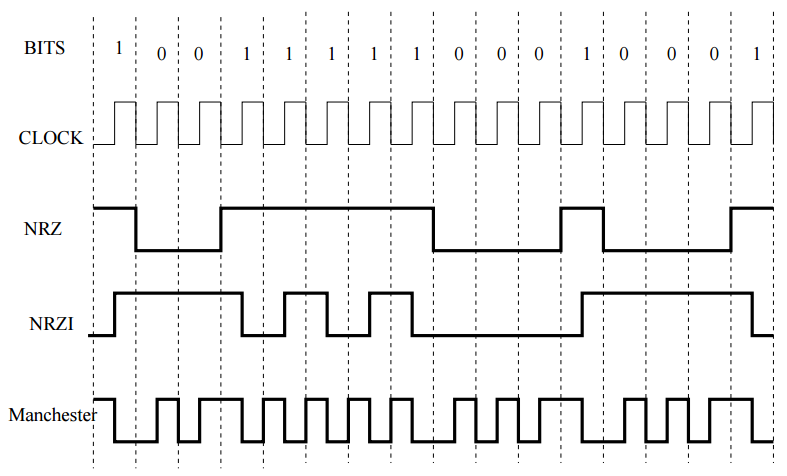

### 2-2

#### Question

Consider an ARQ algorithm running over a 40-km point-to-point fiber link.  
(a) Compute the one-way propagation delay for this link, assuming that the speed of light is 2×10^8 m/s in the fiber.  
(b) Suggest a suitable timeout value for the ARQ algorithm to use.  
(c) Why might it still be possible for the ARQ algorithm to time out and retransmit a frame, given this timeout value?

#### Solution

(a) 40 km / 2×10^8 m/s = 0.2ms  
(b) 0.2 ~ 0.4 ms  
(c) Propagation delay is only one source of delays. Packets may experience delays by sitting in queues waiting to be processes and acknowledged. If these delays exceed the safety constant than ARQ will retransmit. 

### 2-3

#### Question

The text suggests that the sliding window protocol can be used to implement flow control. We can imagine doing this by having the receiver delay ACKs, that is, not send the ACK until there is free buffer space to hold the next frame. In doing so, each ACK would simultaneously acknowledge the receipt of the last frame and tell the source that there is now free buffer space available to hold the next frame. Explain why implementing flow control in this way is not a good idea.

#### Solution

If the receiver delays sending an ACK until buffer space is available, it risks delaying so long that the sender times out unnecessarily and retransmits the frame.

### 2-4

#### Question

Let A and B be two stations attempting to transmit on an Ethernet. Each has a steady queue of frames ready to send; A’s frames will be numbered A1, A2, and so on, and B’s similarly. Let T = 51.2 μs be the exponential backoff base unit. Suppose A and B simultaneously attempt to send frame 1, collide, and happen to choose backoff times of 0×T and 1×T,
respectively, meaning A wins the race and transmits A1 while B waits. At the end of this transmission, B will attempt to retransmit B1 while A will attempt to transmit A2. These first attempts will collide, but now A backs off for either 0×T or 1×T, while B backs off for time equal to one of 0×T, . . . ,3×T.

(a) Give the probability that A wins this second backoff race immediately after this first collision; that is, A’s first choice of backoff time k ×51.2 is less than B’s.

(b) Suppose A wins this second backoff race. A transmits A3, and when it is finished, A and B collide again as A tries to transmit A4 and B tries once more to transmit B1. Give the probability that A wins this third backoff race immediately after the first collision.

(c) Give a reasonable lower bound for the probability that A wins all the remaining backoff races.

(d) What then happens to the frame B1? This scenario is known as the Ethernet capture effect.

#### Solution

(a) 1/2 x 4/3 + 1/2 x 2/4 = 5/8  
(b) 1/2 x 7/8 + 1/2 x 6/8 = 13/16  
(c) 

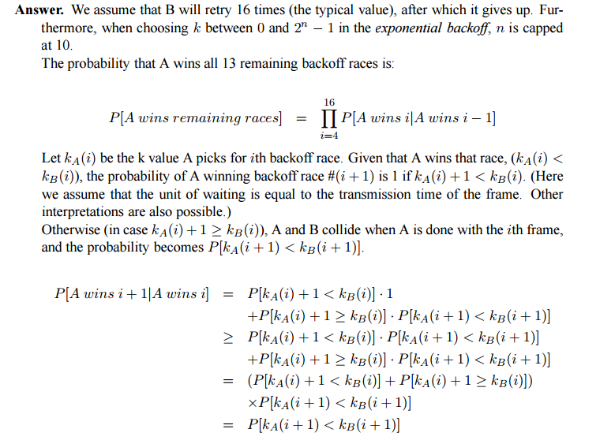
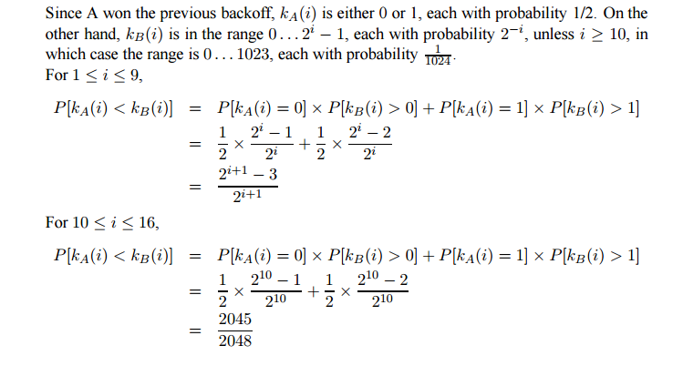
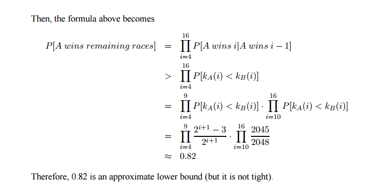

(d) B1 will be dropped, and B will try the next frame B2.

### 2-5

#### Question

Suppose A, B, and C all make their first carrier sense, as part of an attempt to transmit, while a fourth station D is transmitting. Now with the assumption that Ethernet is p-persistent with p = 0.33 (that is, a waiting station transmits immediately with probability p when the line goes idle and otherwise defers one 51.2-μs slot time and repeats the process). 

Draw a timeline showing one possible sequence of transmissions, attempts, collisions, and exponential backoff choices. Your timeline should meet criterion:  
 (i) of the previous problem, but in lieu of criterion  
 (ii) you should show at least one collision and at least one run of four deferrals on an idle line.   
Again, note that many solutions are possible.  

#### Solution

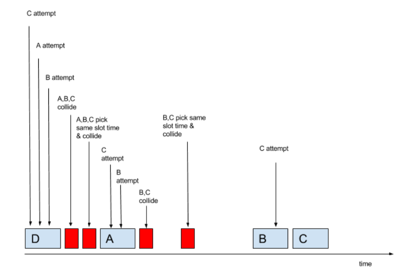

### 3-1

#### Question

Using the example network given in Figure 3.44, give the virtual circuit tables for all the switches after each of the following connections is established. Assume that the sequence of connections is cumulative; that is, the first connection is still up when the second connection is established, and so on. Also assume that the VCI assignment always picks the lowest unused VCI on each link, starting with 0, and that a VCI is consumed for both directions of a virtual circuit.  
(a) Host A connects to host C.  
(b) Host D connects to host B.  
(c) Host D connects to host I.  
(d) Host A connects to host B.  
(e) Host F connects to host J.  
(f ) Host H connects to host A.  

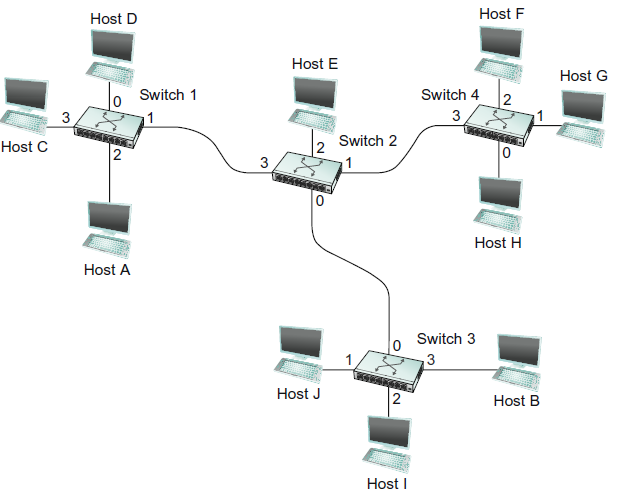

#### Solution

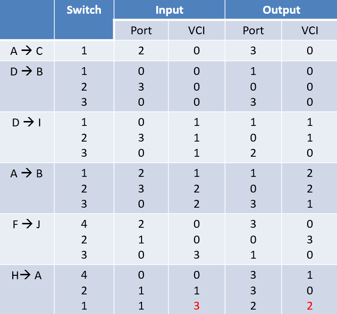

### 3-3

#### Question

For the network given in Figure 3.45, give the datagram forwarding table for each node. The links are labeled with relative costs; your tables should forward each packet via the lowest-cost path to its destination.

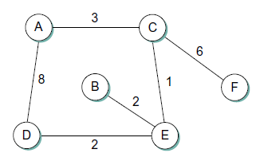

#### Solution

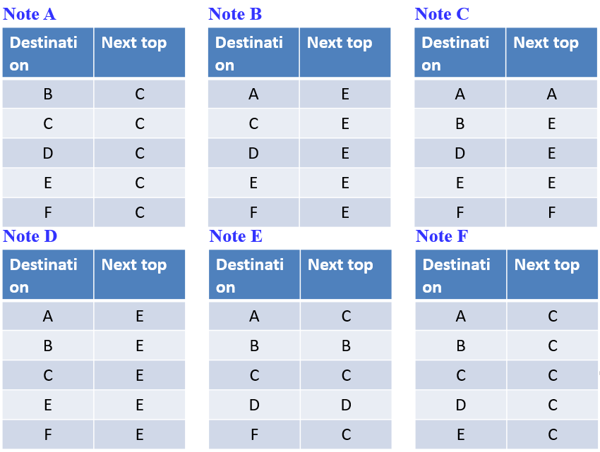

### 3-5

#### Question

Consider the virtual circuit switches in Figure 3.47. Table 3.15 lists, for each switch, what <port, VCI> (or <VCI, interface>) pairs are connected to what other. Connections are bidirectional. List all endpoint-to-endpoint connections.

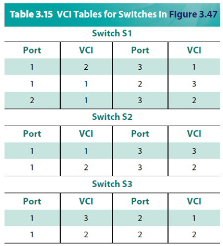

#### Solution

A -> S1 -> S2 -> S3 -> D  
A-> B  
B -> S1 -> S2 -> S3 -> D

### 3-13

#### Question and Solution

Given the extended LAN shown in Figure 3.48, indicate which
ports are not selected by the spanning tree algorithm.

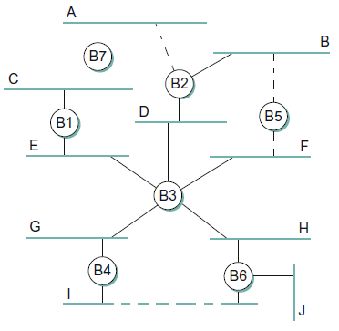

### 3-15

#### Question

Consider the arrangement of learning bridges shown in Figure 3.49. Assuming all are initially empty, give the forwarding tables for each of the bridges B1 to B4 after the following transmissions:  
  A sends to C.  
  C sends to A.  
  D sends to C.  
Identify ports with the unique neighbor reached directly from that port; that is, the ports for B1 are to be labeled “A” and “B2.”

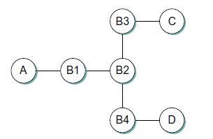

#### Solution

A -> B1 -> B2 -> B3 -> C  B4 -> D  
C -> B3 -> B2 -> B1 -> A  
D -> B4 -> B2 -> B3 -> C  

B1:   A ->  A        B2 -> C  
B2:   B1 -> A       B3 -> C    B4 -> D   
B3:  B2 -> A, D    C -> C  
B4:   B2 -> A        D ->D   

### 3-17

#### Question

Consider hosts X, Y, Z,W and learning bridges B1, B2, B3, with initially empty forwarding tables, as in Figure 3.50.  
(a) Suppose X sends to W. Which bridges learn where X is? Does Y’s network interface see this packet?  
(b) Suppose Z now sends to X. Which bridges learn where Z is? Does Y’s network interface see this packet?  
(c) Suppose Y now sends to X. Which bridges learn where Y is? Does Z’s network interface see this packet?  
(d) Finally, suppose W sends to Y. Which bridges learn where W is? Does Z’s network interface see this packet?  

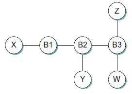

#### Solution

X -> W :   All bridges learn where X is  
 Y’s network interface see this packet

Z -> X :    All bridges learn where Z is   
Y’s network interface does not see this packet

Y -> X :     B1 and B2 learn where Y is  
Z’s network interface does not see this packet

W -> Y :    B2 and B3 learn where W is   
Z’s network interface see this packet

### 3-36

#### Question

Suppose a TCP message that contains 1024 bytes of data and 20 bytes of TCP header is passed to IP for delivery across two networks interconnected by a router (i.e., it travels from the source host to a router to the destination host). The first network has an MTU of 1024 bytes; the second has an MTU of 576 bytes. Each network’s MTU gives the size of the largest IP datagram that can be carried in a link-layer frame. Give the sizes and offsets of the sequence of fragments delivered to the network layer at the destination host. Assume all IP headers are 20 bytes.

#### Solution

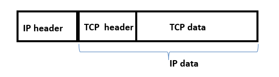

In first network: MTU is 1024 bytes,  the room of IP data is 1024-20 = 1004 bytes. Since the Offset field counts 8-byte chunks, the fragment contains 1000 bytes (1004 = 8×125+4).  
The total transmission bytes is 1024+20 =1044. It is fragmented into fragments of size 1000+20=1020 bytes and 44 +20=64 bytes. The offsets are 0 and 125, respectively.

In second network: MTU is 576 bytes, the room of IP data is 576-20 = 556 bytes. Since the Offset field counts 8-byte chunks, the fragment contains 552 bytes (556 = 8×69+4).  
It is fragmented into fragments of size 552+20=572 bytes, 448+20=468 bytes, and 44 +20=64 bytes. . The offsets are 0, 69, and  125, respectively.

### 3-55

#### Question

Suppose a router has built up the routing table shown in Table 3.18. The router can deliver packets directly over interfaces 0 and 1, or it can forward packets to routers R2, R3, or R4. Describe what the router does with a packet addressed to each of the following destinations:  
(a) 128.96.39.10  
(b) 128.96.40.12  
(c) 128.96.40.151  
(d) 192.4.153.17  
(e) 192.4.153.90  

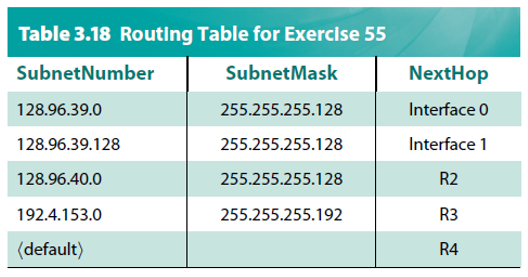

#### Solution

First, the address of destination AND subnet mask, then compare the result with  the subnet number.  
128.96.39.10 AND 255.255.255.128 equals 128.96.39.0       -> Interface 0  
       10000000 01100000 00100111 00001010   
       11111111 11111111 11111111 10000000  
       10000000 01100000 00100111 00000000 = 128. 96. 39.0  

b)   128.96.40.12 AND 255.255.255.128 equals  128.96.40.0      -> R2  

c)    There is no match -> R4  

d)    192.4.153.17 AND 255.255.255.192 equals 192.4.153.0      -> R3  

e)    There is no match -> R4

### 3-72

#### Question

Table 3.20 is a routing table using CIDR. Address bytes are in hexadecimal. The notation “/12” in C4.50.0.0/12 denotes a netmask with 12 leading 1 bits: FF.F0.0.0. Note that the last three entries cover every address and thus serve in lieu of a default route. State to what next hop the following will be delivered:  
(a) C4.5E.13.87  
(b) C4.5E.22.09  
(c) C3.41.80.02  
(d) 5E.43.91.12  
(e) C4.6D.31.2E  
(f ) C4.6B.31.2E  
  
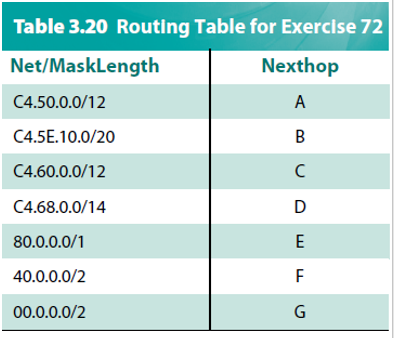

#### Solution
Choose the address with longest Match  

a)  11000100 01011110 00010011 10000111  
/20=11000100 01011110 00010000 00000000 = C4.5E.10.0

b)  11000100 01011110 00100010 00001001  
/12=11000100 01010000 00000000 00000000 = C4.50.0.0  

c) 11000011 01000001 10000000 00000010
/1=10000000 00000000 00000000 00000000 = 80.0.0.0

d) 01011101 01000011 10010001 00010010
/2=01000000 00000000 00000000 00000000 = 40.0.0.0

e)  11000100 01101101 00110001 00101110
/12=11000100 01100000 00000000 00000000 = C4.60.0.0

f)  11000100 01101011 00110001 00101110
/14=11000100 01101000 00000000 00000000 = C4.68.0.0

a) B      b) A      c) E       d) F       e) C      f) D 

### 4-20

#### Question

Determine which IPv6 address notations are correct:  
(a) ::0F53:6382:AB00:67DB:BB27:7332  
(b) 7803:42F2:::88EC:D4BA:B75D:11CD  
(c) ::4BA8:95CC::DB97:4EAB  
(d) 74DC::02BA  
(e) ::00FF:128.112.92.116  

#### Solution

a,d,e

### 5-10

#### Question

You are hired to design a reliable byte-stream protocol that uses a sliding window (like TCP). This protocol will run over a 1-Gbps network.  
The RTT of the network is 140 ms, and the maximum segment lifetime is 60 seconds.  
How many bits would you include in the AdvertisedWindow and SequenceNum fields of your protocol header?

#### Solution

To fully utilize the network, AdvertisedWindow needs to be larger than (Delay × Bandwidth).

(AdvertisedWindow) ≥ (Delay) × (Bandwidth)  
= 140ms × 1Gbps  
= 140Mbit  
= 17.5MB

2^24 = 16,777,216  
2^25 = 33,554,432  

Therefore, 25 bits are needed for AdvertisedWindow

SequenceNum needs be large enough that the sequence number does not wrap around before any delayed segments have left the network, which is presumed to occur within the maximum segment lifetime.

(ScquenceNum) ≥ (Maximum Segment Lifetime) × (Bandwidth)   
= 60s x 1Gbps  
= 60Gbit  
= 7.5GB

2^32 = 4,294,967,296  
2^33 = 8,589,934,592

Therefore, 33 bits are needed for SequenceNum.

